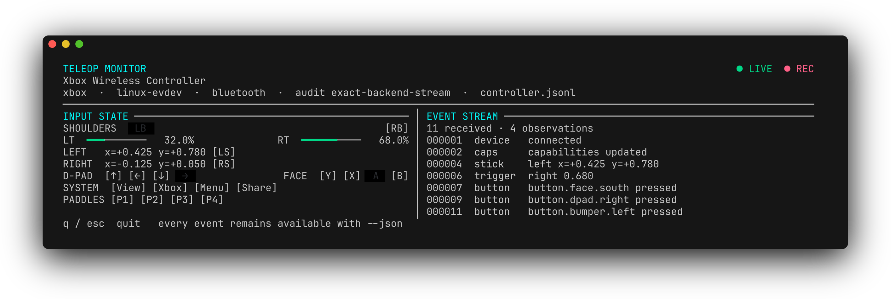

# teleop

[](https://pkg.go.dev/github.com/open-ships/teleop)

Normalized, loss-aware game-controller input for Go teleoperation and autonomy
applications.

`teleop` separates controller hardware and operating-system APIs from
application control logic. It exposes transport-independent state snapshots,
an ordered event stream, optional gestures and semantic actions, fail-closed
output authority with expiring command leases, and signed, externally witnessed
audit recording. The included `xbox` provider works on Linux, macOS, and
Windows.

> [!IMPORTANT]
> `teleop` is not a certified safety controller. Its strict path combines
> fresh OS/framework connection evidence, a dead-man switch, loop watchdog,
> latching stop, durable evidence, an engineered safe state, and
> receiver-enforced command leases. It does not replace a hardware emergency
> stop, safety-rated interlocks, physical feedback, vessel-specific command
> validation, or an actuator that reaches a safe state when lease renewal stops.
> A backend also cannot report input that the device, radio, driver, or OS never
> delivered.

The API has completed its pre-v1 review. The `v1.0.0` tag begins the Go module
compatibility commitment. Validate backend mappings on the exact controller,
OS/driver, radio, and actuator combination before deployment.

## Features

- Controller-neutral `GameController`, `Provider`, `State`, and `Event` APIs
- Normalized sticks, triggers, buttons, and four-way D-pad with diagonals
- Normalized low- and high-frequency controller rumble
- Xbox A/B/X/Y aliases without coupling application code to printed labels
- Typed input, connection, capability, error, and known-loss events
- Multiple controllers, fan-out subscriptions, and explicit hotplug watching
- Lossless delivery for command consumers and latest-value delivery for UIs
- Tap, double-tap, hold, chord, stick-region, and trigger-threshold gestures
- Application-defined action bindings with causal event IDs
- Application command records linked to the input that caused them
- Strict maritime interlocks with release-neutral-arm-fresh-press sequencing
- Independent backend connection checks distinct from unchanged operator state
- Serialized Safety Authority with expiring leases and acknowledged fallback
- Assured Session composition that hides raw hazardous-output seams
- Monotonic event timing and wall-clock step detection
- Immutable-at-admission, hash-chained JSON Lines audit logs with sync barriers
- Ed25519-signed Merkle heads, witness receipts, quorum anchoring, and strict close
- Build/configuration provenance and caller-declared operator/grant metadata
- Fake and replay input sources for tests
- Interactive terminal monitor and machine-readable JSON output

The library packages do not install a global registry. Platform syscall
wrappers use `golang.org/x/sys`; the optional terminal monitor uses Bubble Tea
and Lip Gloss.

## Install

`teleop` currently requires Go 1.26 or newer.

```sh
go get github.com/open-ships/teleop
```

Pair or connect controllers through the host operating system first. The
package does not implement Bluetooth or Xbox Wireless pairing.

Releases follow semantic versioning. [`VERSION`](VERSION) declares the release
baseline. After successful CI on the current `main` commit, the
exact-version-tagged shared Open Ships release policy publishes an annotated
tag, deterministic source archive, checksums, SBOM, toolchain evidence, and
separate build-provenance and SBOM attestations.

## Quick start

Discover a controller, subscribe to its event stream, and consume normalized
input:

```go
provider := xbox.NewProvider()
devices, err := provider.Discover(ctx)
if err != nil {
    return err
}
if len(devices) == 0 {
    return errors.New("no Xbox controller connected")
}

controller, err := provider.Open(ctx, devices[0].ID)
if err != nil {
    return err
}
defer controller.Close()

events, err := controller.Subscribe(teleop.SubscriptionOptions{
    Delivery: teleop.DeliveryLossless,
    Buffer:   1024,
})
if err != nil {
    return err
}
defer events.Close()

for {
    event, err := events.Next(ctx)
    if err != nil {
        return err
    }

    switch event := event.(type) {
    case teleop.ButtonEvent:
        log.Printf("%s %s", event.Button, event.Phase)
    case teleop.StickEvent:
        log.Printf(
            "%s stick: x=%+.3f y=%+.3f",
            event.Stick,
            event.Position.X,
            event.Position.Y,
        )
    case teleop.TriggerEvent:
        log.Printf("%s trigger: %.3f", event.Trigger, event.Position)
    }
}
```

See the complete runnable example in
[`examples/basic`](examples/basic/main.go).

For applications that need current intent rather than every transition, take a
thread-safe snapshot:

```go
state := controller.Snapshot()
forward := teleop.ApplyRadialDeadZone(state.LeftStick, 0.12).Y
armed := state.Button(xbox.ButtonA)
```

`SnapshotWithMeta` also returns observation, state-change, and independent
transport-check timing; connection, invalid, stale, and synthetic flags; and
whether silence is verifiable for this source. Game-controller backends are
change-driven, so a held control can legitimately produce no new observations.
The strict safety profile relies on independent Transport Health instead of
mistaking unchanged operator state for disconnect. Confirmed disconnects always
synthesize a neutral state and release events.

The scope of that evidence is deliberately narrow. Linux performs a fresh
`EVIOCGID` ioctl against the retained evdev descriptor to check that the kernel
still recognizes the attachment. macOS checks that the exact retained
controller remains in `GCController.controllers` to establish current
GameController-framework membership. Neither check challenges the physical
controller or radio, and operating-system disconnect-detection latency still
applies. Each backend descriptor's `transport_health_scope` property records
the checked seam.

## Controller rumble

Check the discovered capability before applying vibration:

```go
if controller.Capabilities().Rumble {
    err := controller.SetRumble(ctx, teleop.Rumble{
        LowFrequency:  0.8,
        HighFrequency: 0.35,
    })
    if err != nil {
        return err
    }
}
```

Both strengths are normalized to `[0,1]`. Backends with discrete motors map
them directly; macOS Core Haptics maps the balance to intensity and sharpness.
A rumble setting remains active until it is replaced, the zero value is
applied, or the controller closes:

```go
err := controller.SetRumble(ctx, teleop.Rumble{})
```

The context bounds the call; canceling it after `SetRumble` returns does not
stop the motors. Every built-in backend stops active rumble during `Close`.

## Input model

Controls are named by physical position so application bindings remain stable
across controller brands. For example, `xbox.ButtonA` is an alias for
`teleop.ButtonFaceSouth`.

- Stick axes are in `[-1, +1]`; positive X is right and positive Y is up.
- Triggers are in `[0, 1]`.
- D-pad directions are independent booleans, so diagonals are preserved.
- D-pad direction changes emit `ButtonEvent` values such as
  `button.dpad.left` with `pressed` or `released` phases.
- `Descriptor.Capability` reports only the controls and output features
  exposed by the selected backend.
- Canonical input is not coalesced and has no dead zone applied. Apply
  `teleop.ApplyRadialDeadZone` only when turning input into commands.

Each backend observation produces an `ObservationEvent`, followed by any
corresponding `ButtonEvent`, `StickEvent`, or `TriggerEvent`.
Events carry a controller session, sequence number, observation time, and
causal event IDs. They also carry a session-relative monotonic timestamp, so
ordering and durations remain meaningful if the host wall clock is corrected;
a material correction is reported as a `ClockEvent`.

### Delivery policies

Each call to `Subscribe` creates an independent bounded queue:

- `DeliveryLossless` terminates with `teleop.ErrSubscriptionOverflow` instead
  of silently dropping input. Use it for command and safety consumers.
- `DeliveryLatest` discards the oldest queued event when full. Use it for
  monitors and other snapshot-oriented consumers.

The default buffer is 1024 events. Choose a buffer based on the consumer's
worst-case latency and always handle the subscription's terminal error.

## Gestures and actions

Processors derive higher-level events without hiding the canonical input.
Attach the gesture recognizer before the action mapper because processors run
in option order:

```go
recognizer := gesture.New(gesture.DefaultConfig())
mapper := action.New(
    action.OnGesture("arm", gesture.Hold, xbox.ButtonA),
    action.OnButton("disarm", xbox.ButtonB, teleop.PhasePressed),
    action.OnStick("drive", teleop.LeftStick),
)

controller, err := provider.Open(
    ctx,
    devices[0].ID,
    teleop.WithProcessor(recognizer),
    teleop.WithProcessor(mapper),
)
```

Record the application command at the same decision boundary that sends it to
the machine. Link it to the input or derived event IDs that produced it so the
audit trail records both operator intent and the command actually considered:

```go
err := controller.RecordCommand(ctx, teleop.Command{
    Name:       "drive.set",
    Payload:    map[string]float64{"forward": forward},
    Authorized: armed,
    Causes:     []teleop.EventID{event.Header().ID},
})
```

`RecordCommand` is non-blocking; `teleop.ErrPipelineOverflow` means the
command could not be admitted to the bounded audit pipeline and should be
treated as a safety fault.

The concrete `*teleop.Controller` also provides `RecordCommandSync`, which
waits until every configured sink callback has completed for the command and
all earlier FIFO events. A sink determines what callback completion means;
`audit.Recorder` synchronizes its local store by default. Cancellation after
queue admission returns `teleop.ErrCommandPublicationUncertain` because it
cannot retract a command that may finish recording later. The `assured` package
uses this barrier and validates the recorder's achieved durability before
hazardous actuation.

Recognized `gesture.Event` and mapped `action.Event` values appear in the same
subscriptions and audit sinks as the input events that caused them.

## Discovery and hotplug

`Discover` returns a descriptor for each connected controller. The Xbox
provider also implements `teleop.WatchingProvider`:

```go
for event := range provider.Watch(ctx) {
    switch event.Kind {
    case teleop.DeviceAdded:
        log.Printf("connected: %s", event.Descriptor.ID)
    case teleop.DeviceRemoved:
        log.Printf("disconnected: %s", event.Descriptor.ID)
    case teleop.DeviceError:
        log.Printf("controller discovery: %s", event.Error)
    }
}
```

Watching is opt-in and stops when `ctx` is canceled. Multiple simultaneous
controllers are exposed independently when the OS provides a distinct device
or XInput slot.

## Platform support

| Platform | Backend | Audit grade | Notes |
| --- | --- | --- | --- |
| Linux | evdev | `AuditExactBackendStream` | Direct `/dev/input` events and `FF_RUMBLE`; no `libudev` dependency |
| macOS | Game Controller | `AuditExactBackendStream` | Input plus Core Haptics rumble; requires cgo |
| Windows | XInput | `AuditSampledState` | Polls up to four slots and uses `XInputSetState` for rumble |

Capabilities vary by controller, driver, and OS. Guide/Xbox, Share, and Elite
paddles are reported only when the backend exposes them. Standard XInput does
not expose these controls. Rumble is advertised only when the selected backend
can drive it.

### Linux setup

The application needs read permission for `/dev/input/event*`. Rumble also
requires write permission. If a rumble-capable device can only be opened
read-only, input remains available and `Capabilities.Rumble` is false for the
open session.

- USB controllers normally use the kernel `xpad` driver.
- Bluetooth controllers commonly use
  [`xpadneo`](https://github.com/atar-axis/xpadneo).
- The Xbox Wireless Adapter requires a compatible GIP driver such as
  [`xone`](https://github.com/medusalix/xone) or a maintained successor.

The Linux backend detects evdev `SYN_DROPPED`, resynchronizes its state, and
emits a `GapEvent`.

## Auditing and replay

By default, the controller freezes every event for canonical sinks before
asynchronous handoff and accepts it into each bounded audit queue before
delivering it to subscribers. This keeps ordinary input decoupled from
filesystem latency. `teleop.WithSynchronousAudit()` instead makes every event
wait for every sink callback before state, subscriber, or processor exposure;
`assured.Session` requires that stronger mode. The explicit command barrier is
also available to applications assembling their own evidence-before-actuation
path:

```go
file, err := os.OpenFile(
    "controller.jsonl",
    os.O_CREATE|os.O_EXCL|os.O_WRONLY,
    0o600,
)
if err != nil {
    return err
}
defer file.Close()

recorder := audit.NewRecorder(file, audit.WithFlushEveryEvent(true))
defer recorder.Close()

controller, err := provider.Open(
    ctx,
    deviceID,
    teleop.WithAuditSink(recorder),
)
```

`audit.ReadAll` verifies a completed log's integrity chain and footer. The
simple example above detects corruption only: an attacker can replace an
unkeyed chain. Use origin-authenticated signing and independent witnessing for
adversarial tamper-evidence. Use `audit.ReadPartial` for a running or
interrupted log. `audit.Observations` and `testkit.NewReplaySource` can then
reproduce its canonical input without controller hardware.
For forensic playback, `audit.Events` decodes the recorded canonical,
gesture, action, command, clock, and lifecycle events directly, preserving
their original identity and timing instead of re-deriving them.

Where a log may become evidence, integrity is not enough. Sign it, anchor it,
and record what interpreted the input:

```go
recorder := audit.NewRecorder(
    file,
    audit.WithSigner(signer),        // Ed25519; prefer a TPM or HSM key
    audit.WithCheckpoints(10*time.Second, 10000),
    audit.WithAnchor(anchor),        // publish heads outside this host
    audit.WithRequiredWitness(true), // final footer must be acknowledged
    audit.WithProvenance(provenance),
)
```

Each mechanism closes a different gap. The hash chain shows the log was not
edited; `WithHMAC` shows a key holder wrote it; `WithSigner` lets an
independently trusted public key authenticate signed tree heads without giving
the verifier signing capability; `WithAnchor` makes a destroyed or truncated
log detectable rather than merely suspected; and `WithProvenance` records the
build, configuration, and operator without which recorded input cannot be
turned back into behavior.
Records also form an RFC 6962 Merkle tree, so a single record can be proved to
a signed head without disclosing the rest of the log.

`Recorder.EvidenceStatus` separates queue acceptance, local durability, and
the witnessed high-water mark; `WaitForWitness` waits for a receipt covering a
specific event count. `audit.NewQuorumAnchor` can require acknowledgements from
multiple independent custody domains. A timer emits checkpoints even when an
operator holds a steady control and no later input arrives.

Those durability and receipt levels report successful configured adapter
barriers. Validate custom `Sync` implementations, remote custody, witness
identity, and trusted receipt time in the deployed system; the process cannot
independently prove that an adapter which returned success told the truth.

Verify completed signed logs with
`audit.ReadTrusted(reader, trustedPublicKey)`. The public key must come from a
separate trusted channel; a key declared only inside the log proves internal
consistency, not device identity. Key provisioning, rotation, revocation, and
destruction are deployment responsibilities.

When feeding a finite `testkit.ReplaySource` through a controller, pass
`teleop.WithDeferredStart()` so `Subscribe` is attached before replay begins.

Known backend loss is published as `GapEvent`. Recorder failures stop the
controller pipeline, and lossless subscriber overflow is explicit. See
[the audit guide](docs/audit.md) for the full guarantee boundary and replay
workflow.

No producer-controlled mechanism is literally tamper-proof: a compromised
producer can omit an event before the recorder sees it. The assured claim is
immutable admission, local crash durability, origin authentication, an
observable externally witnessed high-water mark, explicit gaps, and a required
witnessed footer. A recent locally durable suffix remains vulnerable to loss or
replacement until an independent witness acknowledges a covering checkpoint;
configure frequent checkpoints and monitor `EvidenceStatus` when that window
must be small.

Within their stated key, adapter, and custody assumptions, these mechanisms
detect alteration and make replacement or truncation of a witnessed prefix
evident. They do not detect input the operating system never delivered or prove
that an application produced a safe vessel command. That is what the next
section addresses.

## Assured safety authority

For hazardous output, use `assured.Session`. It composes the strict
`safety.NewMaritime` profile, audit recorder, external witness, and one
serialized `safety.Authority`; it does not expose the raw controller or
actuator path.

The operator sequence is deliberately strict:

1. Start the single continuous `Session.Apply` loop; before live authority is
   established it exercises the software/adapter path while applying only the
   Engineered Safe State. An acknowledgement is not physical-state proof.
2. Observe the dead-man released and every control neutral.
3. Call `Session.Arm`.
4. Observe a fresh post-arm dead-man press.
5. Keep submitting each intent through that loop at an interval comfortably
   shorter than the loop watchdog and Command Lease.

`Apply` evaluates interlocks at the actuation boundary, durably records the
decision and intent, transmits a session-bound command with an expiry lease,
and validates the matching actuator acknowledgement. Assured configuration
requires the adapter to assert an application time inside that lease. When any
configured teleop condition is unproven, the authority substitutes the
vessel-specific Engineered Safe State.

Authority does not validate a command's actuator mapping, units, bounds,
rate/slew, vessel-mode constraints, or operator permission. In this fragment,
`validatedThrottle` must already have passed an authenticated, vessel-specific
command policy:

```go
// This is one iteration of the already-running authoritative Apply loop.
result, err := session.Apply(ctx, safety.ApplyRequest{
    Intent: safety.VesselCommand{
        Name:    "propulsion.set",
        Payload: map[string]any{"throttle": validatedThrottle},
    },
    Causes: []teleop.EventID{inputEvent.Header().ID},
    Detail: "captain propulsion request",
})
if err != nil {
    return err // stop ordinary output; receiver-side lease expiry is mandatory
}
if result.Fallback {
    log.Printf("request inhibited: %v", result.Decision.Reasons)
}
```

Transport Health is independent of input changes, so a steady held command can
remain valid only while the backend keeps confirming its documented
OS/framework connection condition. This does not establish fresh physical or
radio responsiveness.
Missing, stale, regressing, timestamp-less, or disconnected health fails
closed. Invalid analog input neutralizes the entire observation; gaps, source
errors, synthetic state, a stalled loop, defeated dead-man, and emergency stop
also inhibit and latch.

The receiver must reject expired or out-of-order leases, enforce independent
hard command/mode limits, and enter its safe state without this process. An
independent hardware emergency stop, safety-rated interlocks, authenticated
physical feedback, authenticated operator authorization, and vessel-specific
hazard analysis remain mandatory deployment controls. See the complete [safety
guide](docs/safety.md) and [safety case](docs/safety-case.md).

## Terminal monitor



List controllers:

```sh
go run ./cmd/teleop-monitor --list
```

Open the first controller in the interactive monitor:

```sh
go run ./cmd/teleop-monitor
```

The Bubble Tea monitor uses the alternate screen, switches between
side-by-side and stacked layouts as the terminal is resized, and exits
immediately with `q`, `Esc`, or `Ctrl-C`. When the opened controller advertises
rumble, press `r` to toggle it and `m` to switch between both components and
alternating low/high (left/right on XInput-style controllers). Use `Tab` to
select the intensity or interval slider and `←`/`→` to adjust it. Intensity
runs from `0.0` to `1.0` in `0.1` steps. The alternating interval is the time
per side and runs from 1 to 10 seconds in one-second steps.
Changes update live while rumble is active. A full-width haptic-feedback
section above the input and event panels shows the controls and rumble state;
failures stay visible with a retry hint.

Record while monitoring:

```sh
go run ./cmd/teleop-monitor --audit controller.jsonl
```

The monitor flag creates a local unkeyed integrity log for diagnostics; it is
not an Assured Session and does not provide origin authentication or external
witnessing.

The interactive TUI uses latest-value delivery and reports any coalesced
events, keeping the recent canonical event list responsive. Use `--device ID`
to select a controller. To losslessly stream every published event, including
raw observations, as JSON Lines:

```sh
go run ./cmd/teleop-monitor --json
```

Output automatically switches to the same JSON Lines stream when stdout is
redirected.

## Packages

| Package | Purpose |
| --- | --- |
| `teleop` | Controller-neutral API, event runtime, normalization, and registry |
| `xbox` | Cross-platform Xbox provider and familiar control aliases |
| `gesture` | Optional gesture recognition |
| `action` | Optional mapping from physical input or gestures to semantic actions |
| `safety` | Strict interlocks, serialized actuation authority, leases, and safe fallback |
| `audit` | Signed, hash-chained JSON Lines recording, verification, and replay extraction |
| `assured` | Strict safety, durable evidence, witnessing, and ordered-session composition |
| `testkit` | Deterministic fake and replay input sources |

Further reading:

- [Architecture guide](docs/architecture.md) — implementing another provider
- [Safety guide](docs/safety.md) — command timeout, dead-man switch, and what
  they do not cover
- [Audit guide](docs/audit.md) — what each integrity mechanism actually proves,
  and the guarantee boundary
- [Safety case](docs/safety-case.md) — claims, evidence, hazards, and deployment
  assumptions

## License

MIT
